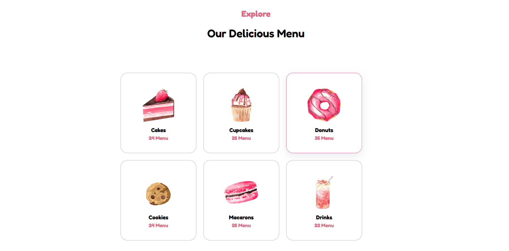
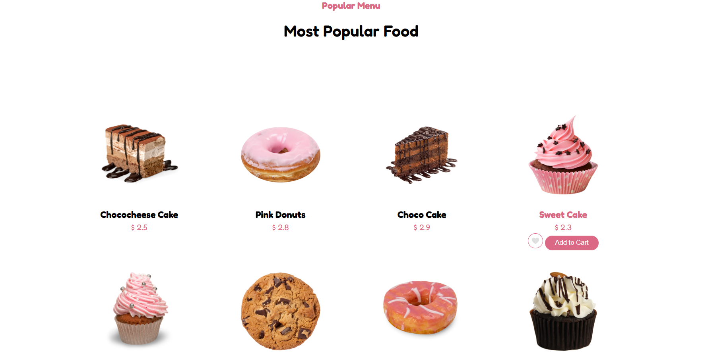

# Pastry Project 🍰

Welcome to **Pastry Project**, a delightful web application built with React to showcase a collection of pastries, recipes, or a bakery management system.

## Table of Contents
- [About the Project](#about-the-project)
- [Features](#features)
- [Technologies Used](#technologies-used)
- [Screenshots](#screenshots)
- [Installation](#installation)
- [Usage](#usage)
- [Contributing](#contributing)
- [License](#license)
- [Contact](#contact)

## About the Project
Pastry Project is a React-based web application for browsing or managing pastries with a user-friendly interface.

## Features
- 🥐 Browse pastries with images and descriptions.
- 🍰 Order management (if implemented).
- 📱 Responsive design.

## Technologies Used
- **React**: ^18.x.x
- **JavaScript**: Core logic
- **CSS/SCSS**: Styling
- **Git & GitHub**: Version control

## Screenshots
Explore the Pastry Project through these snapshots:

| Homepage | Product Page | Order Form |
|----------|--------------|------------|
|  |  |  |

## Installation
1. Clone the repository:
   ```bash
   git clone https://github.com/NahidKameli/Pastry-Project.git
   cd Pastry-Project
